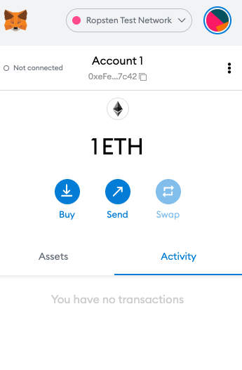
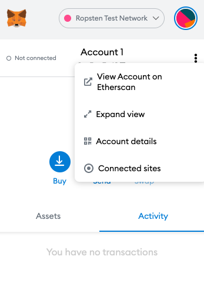
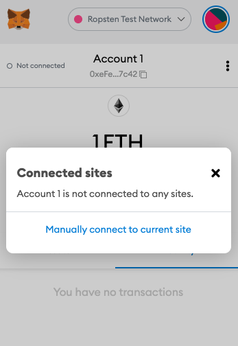
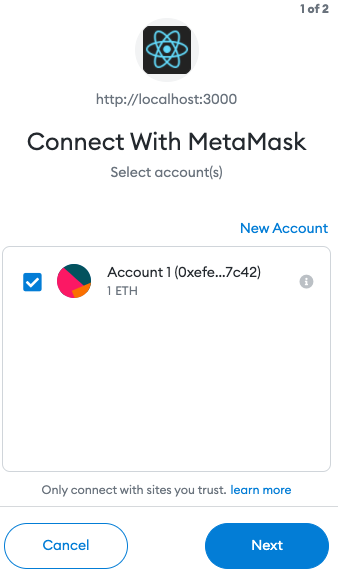
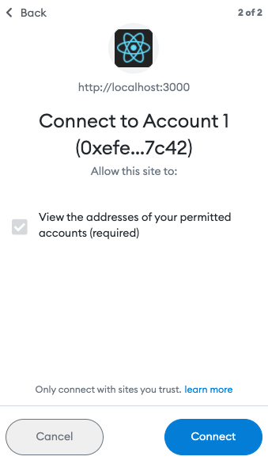

# Artists Marketplace for NFTs

This project was bootstrapped with [Create React App](https://github.com/facebook/create-react-app).
Hardhat was used for handling ethereum smart contracts. The smart contracts were inspired by https://dev.to/dabit3/building-scalable-full-stack-apps-on-ethereum-with-polygon-2cfb.

Check out an example at https://main.d12layvlh21wx4.amplifyapp.com/. Please use a browser with metamask connected to a ropsten address. 

## Available Scripts

In the project directory, install all dependencies by running:
```
npm i
```
Or
```
npm install
```
To get your own blockchain node running, you can run:
```
npx hardhat node 
```
take note of the private key in your localhost addresses and place it in the hardhat.config.js file as PRIVATE_KEY.

deploy the first marketplace contract using:
```
npx hardhat run --network localhost scripts/nftMarketDeploy.js 
```
taking note of the marketplace address it was deployed to, add the address in 
scripts/nftdeploy.js at marketaddressdeployed and src/contractconfig.js at NFT_MARKET_ADDRESS
before deploy the first marketplace contract using:
```
npx hardhat run --network localhost scripts/nftdeploy.js 
```
Then add the nft address it was deployed to and add it to src/contractconfig.js at NFT_ADDRESS

Now, start react app with:
```
npm start
```
You can view the website on your computer and even interact with it by using metamask chrome extension to list your own nfts! Yay!

### Using the app with metamask 
First, connect to the Ropsten Test Network


Afterwards, connect to the site by clicking on the 3 dots and click the "Connected sites"


Next, click on "Manually connect to current site"


Then, click on "Next" and "Connect"



Finally, you'll be able to see that the metamask account is connected as indicated by the green light


### Uploading and minting NFT artwork to place on marketplace:


### Buying NFT as a different user (with a different address):


<!--  -->

